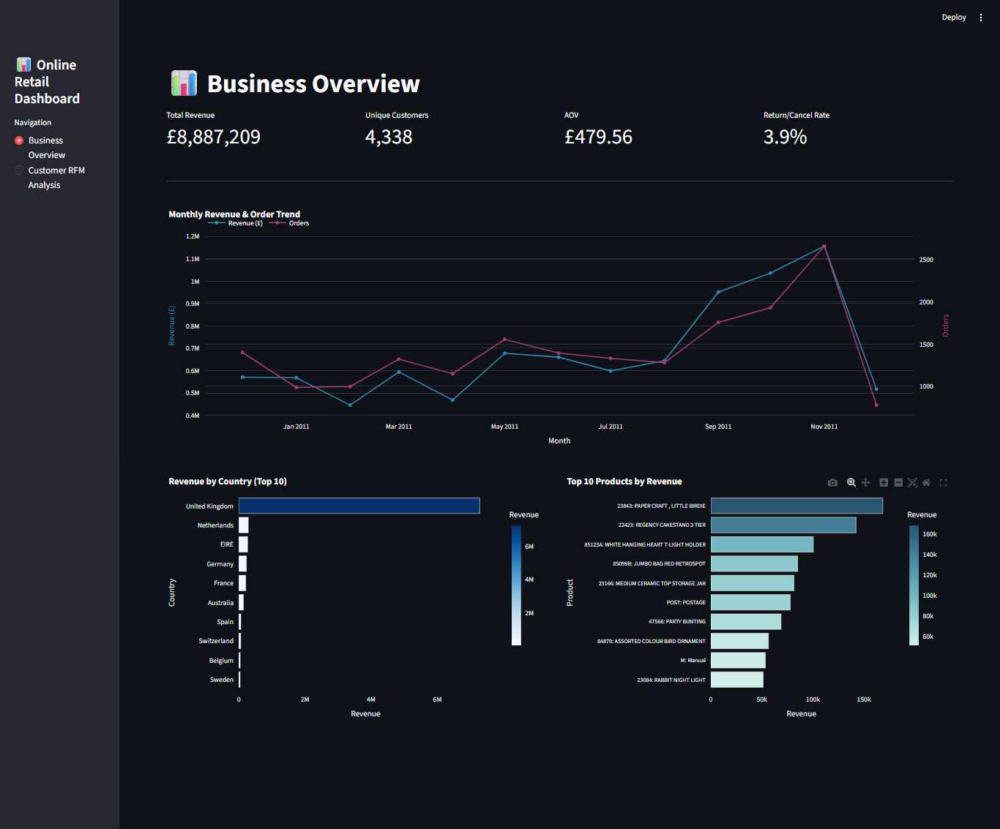
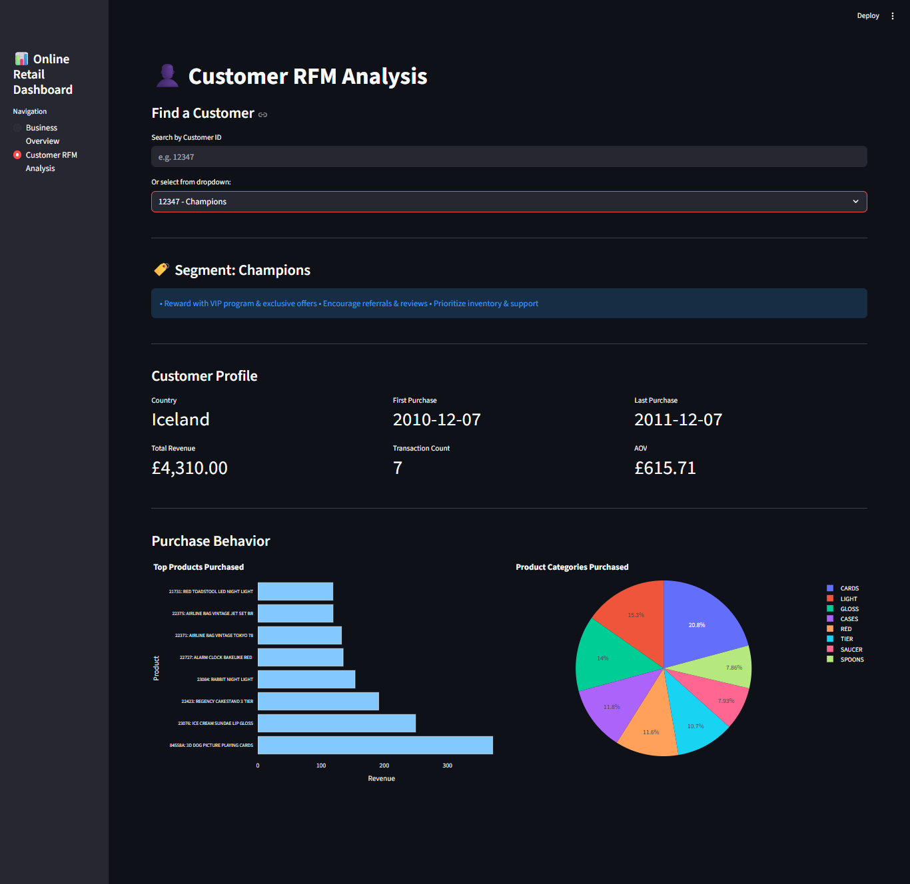

# Online Retail Streamlit Dashboard

This repo contains a small, interactive dashboard built with **Streamlit** using the **Online Retail** dataset. It’s split into two pages: a quick business overview and a customer **RFM** (Recency, Frequency, Monetary) analysis.

## What’s inside

- **Business Overview**
  - Total revenue, unique customers, average order value (AOV)
  - Return/cancel rate
  - Monthly revenue + order trends
  - Top countries and top products by revenue
- **Customer RFM Analysis**
  - RFM scoring + segment label (e.g., Champions, Loyal Customers, At Risk)
  - Simple recommendations per segment
  - Customer profile + purchase behavior charts

## Screenshots




## Quick start (run locally)

### 1) Install requirements

```bash
python -m pip install -r requirements.txt
```

### 2) Put the dataset in the right place

The app reads the Excel file from the same folder as `dashboard.py`. Make sure this file exists:

- `Online Retail.xlsx`

### 3) Run the app

```bash
python -m streamlit run dashboard.py
```

Streamlit will print a URL (usually `http://localhost:8501`). Open it in your browser.

## Files

- `dashboard.py`: the Streamlit app
- `requirements.txt`: dependencies
- `rfm_analysis.ipynb`, `retail_data_analysis.ipynb`: exploration / analysis notebooks
- `screenshots/`: images used in this README

## Troubleshooting

- If Windows says **`streamlit` is not recognized**, run it like this instead (recommended):
  - `python -m streamlit run dashboard.py`

